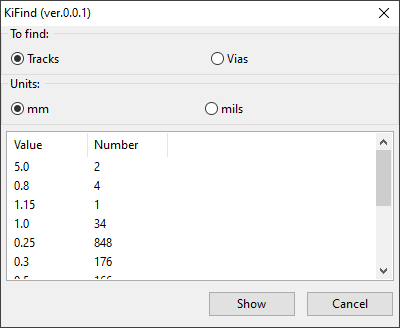

# KiFind tracks/vias plugin for KiCad

This KiCad action plugin searchs for tracks or vias with selected width. 

## Install
Just copy the whole KiFind folder into the KiCad plugins directory, then restart KiCad. The KiFind plugin should now be available in the Tools/External plugin menu. KiFind icon will also be shown in the tools bar of your pcbnew editor.

## Usage
Just start the plugin and select whatever you want to find (tracks or vias). After the execution all tracks or vias with choosen parameters will be selected.

